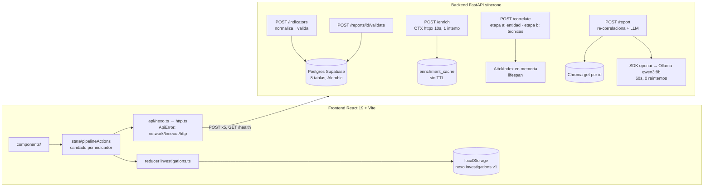
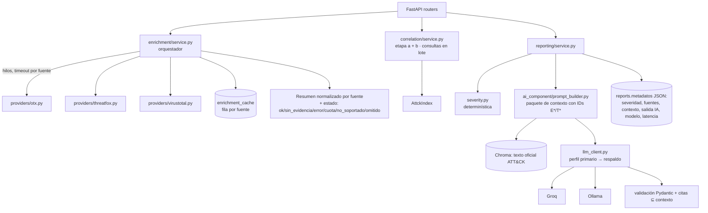

# Fase 0 — Diagnóstico y línea base

Fecha: 2026-09-30. Documento de referencia del sprint de evolución de NEXO (corte de demo
de 72 h). Contiene el diagnóstico completo aprobado y las mediciones de línea base contra
las que se comparan las fases siguientes.

## Línea base medida

**Suite de tests:** 193 passed (pytest contra el Postgres local de Docker).

**Consultas SQL de `correlate_indicator`** por escenario oficial (bundle ATT&CK 19.1 real,
Postgres de tests con rollback). "1.ª" = primera correlación (inserta entidad, técnicas y
links); "repetida" = correlación idempotente, que es lo que hace `/report` al re-correlacionar.

| Escenario | Indicador | Entidad | Técnicas | Queries 1.ª | Queries repetida |
|---|---|---|---:|---:|---:|
| 1 amenaza conocida | `24d004a1…` | wannacry | 16 | 102 | 34 |
| 2 información incompleta | `190.24.150.33` | — | 0 | 0 | 0 |
| 3 múltiples técnicas | `googledrive.network` | lazarus group | 93 | 552 | 188 |
| 3 múltiples técnicas | `edde2e63…` | remcos | 38 | 192 | 78 |
| 3 múltiples técnicas | `84.234.75.108` | dridex | 15 | 74 | 32 |
| 4 misma campaña | `2c4a910a…` | sunburst | 36 | 172 | 74 |
| 4 misma campaña | `ervsystem.com` | sunburst | 36 | 76 | 74 |
| 5 indicador benigno | `8.8.8.8` | — | 0 | 0 | 0 |
| 6 asociación incorrecta | `32519b85…` | blackcat | 21 | 100 | 44 |

**RTT a Supabase** (`SELECT 1`, 10 muestras, solo lectura): mediana **75 ms** (mín. 74, máx. 147).

**Estimación de latencia de BD en "Análisis completo"** (correlate + re-correlación en
`/report`) = queries × 75 ms: WannaCry ≈ (102 + 34) × 75 ms ≈ **10 s**; Lazarus Group ≈
(552 + 188) × 75 ms ≈ **55 s**. Confirma el hallazgo D4: el cuello de botella dominante
contra Supabase es la correlación N+1, no el LLM en GPU (~4 s).

Procedimiento: script de medición con un listener `before_cursor_execute` de SQLAlchemy
sobre `TEST_DATABASE_URL`, cada escenario dentro de una transacción revertida al final.

---

## Contexto

NEXO (backend FastAPI + consola React) ya ejecuta de punta a punta la cadena
indicador → OTX → ATT&CK (dos etapas) → informe LLM+RAG → validación humana, con
tests serios (pytest contra Postgres, 6 escenarios reales congelados; Vitest con
cobertura ≥ 90 %). El objetivo es evolucionarlo hacia una plataforma de Threat
Intelligence + IA con apariencia y arquitectura de producto, sin reconstruirlo.

**Decisiones del usuario (2026-09-30):**
- Proveedor cloud de IA: **Groq**, con Ollama como proveedor local y respaldo.
- Nuevas fuentes: **ThreatFox + VirusTotal**.
- Tema: **oscuro por defecto + claro**.
- **La demo es en 3 días (≈ 2026-10-03).** Esto define todo el roadmap: hay un
  *corte de demo de 72 h* (sección 15) y el resto pasa a la fase 2, después de la demo.

Todo el análisis parte del código leído, archivo por archivo, en ambos repos. Las referencias `archivo:línea`
son relativas a `nexo-intel-backend/` o `nexo-intel-frontend/`.

---

## 1. Resumen ejecutivo

1. **La base es buena y hay que conservarla.** Separación de capas limpia, lógica de
   dominio pura y testeable, errores explícitos (502 ≠ "sin evidencia"), cadena de
   dos etapas con corte verificable y un frontend con arquitectura unidireccional,
   accesibilidad y tests. Nada justifica reescribir ni cambiar de stack.
2. **El multi-proveedor de IA es, casi entero, configuración.** El cliente ya usa el SDK
   `openai` con `LLM_BASE_URL`. Ollama, Groq y OpenRouter hablan el mismo protocolo, así que
   no hace falta una jerarquía `AIProvider` con una clase por proveedor. Lo que sí falta es
   un parámetro que hoy está fijo en el código: `extra_body={"reasoning_effort": "none"}`
   (`app/ai_component/llm_client.py:47`). Groq solo acepta `none` en Qwen; con
   `gpt-oss` devuelve 400. Ese 400 se traga en silencio (`service.py:35`, sin log) y el
   informe sale sin análisis, así que cambiar de proveedor hoy puede romper la IA sin que
   nadie lo note.
3. **El "RAG" no hace búsqueda semántica.** En tiempo de ejecución, Chroma solo hace
   `collection.get(ids=...)`, una consulta por clave (`vectorstore.py:57`). Los embeddings
   solo se usan al sembrar. Funciona y es determinístico (una virtud para evitar
   alucinaciones), pero hay que presentarlo con honestidad: *recuperación del texto oficial
   de ATT&CK de las técnicas de la entidad resuelta*.
4. **La trazabilidad existe, pero es invisible.** El informe es un blob Markdown. No
   guarda qué se envió al modelo, qué modelo respondió, cuánto tardó ni qué es evidencia y
   qué es inferencia. Para que la trazabilidad sea la característica diferencial falta un
   análisis estructurado, validado y persistido.
5. **Cuello de botella probable: consultas N+1 contra Supabase** en
   `correlate_indicator` (`correlation/service.py:139-156`). Hay 2 SELECT por técnica y
   hasta 3 viajes más por cada inserción (`flush` + `refresh`). SUNBURST tiene 36 técnicas,
   Cobalt Strike 73 y Kimsuky 130 (medido sobre el bundle 19.1). Además `/report` vuelve a
   correlacionar, así que el costo se duplica en "Análisis completo". Con el pooler remoto
   pueden ser segundos; se mide en la fase 0.
6. **El backend no tiene endpoints GET.** El frontend vive de `localStorage`. Esto limita
   el dashboard, impide los enlaces directos y deja un callejón sin salida en el 409. Es
   deuda real, pero **no bloquea la demo** (un solo navegador), así que va a la fase 2.
7. **Visualmente**, el frontend usa una estética de consumo tipo Apple (azul `#0071e3`,
   radios de 28 px, pastillas de 980 px), solo en tema claro. Pone formulario, historial,
   KPIs, cabecera, *stepper*, cadena de evidencia y pestañas en una sola pantalla. Las
   piezas son buenas; lo que falla es la jerarquía y el lenguaje visual.

---

## 2. Arquitectura actual



**Backend.** Tiene tres capas (`api/`, módulos de dominio puros, `db/` + `schemas/`).
Los repositorios hacen `flush` y los endpoints, `commit`. La configuración es única
(`core/config.py`, pydantic-settings). El índice ATT&CK y Chroma viven en `app.state`.
El informe es una plantilla determinística más un párrafo del LLM que, si falla, se
reemplaza por un texto de "no disponible".

**Frontend.** El flujo es unidireccional: componentes → acciones → `nexoApi` → reducer →
persistencia. La lógica pura vive en `domain/` (pasos y prerrequisitos, lectura defensiva
de OTX, orden de tácticas, traducción de fallos). La UI es de una sola página: una barra
lateral (formulario + lista) y un área principal (KPIs + detalle con pestañas).

---

## 3. Fortalezas a conservar

| Qué | Dónde | Por qué conservarlo |
|---|---|---|
| Cadena de dos etapas con corte explícito, sin usar `pulse.name`, descartando pulses masivos y con voto por soporte | `correlation/service.py` | Es el núcleo académico y se validó con datos reales (Etapa 9) |
| 502 ≠ "sin evidencia" | `api/enrichment.py:34`, `domain/failures.ts` | Es el principio que debe extenderse a cada fuente nueva |
| Normalización + validación en el `model_validator` | `schemas/indicator.py` | Correcta y testeada |
| Lógica de dominio pura, sin FastAPI | `ingestion/`, `normalization/`, `correlation/` | Permite testear sin servidor |
| Superficie de *prompt injection* mínima: al prompt solo llegan el valor validado, nombres canónicos de ATT&CK y texto oficial de MITRE | `prompt_builder.py` | Es la regla que deben respetar las fuentes nuevas |
| El LLM no decide nada; si falla, el informe sale igual | `ai_component/service.py` | Da robustez. Se mantiene: severidad y confianza siguen siendo determinísticas |
| Handler global 500 sin filtrar detalles; CORS sin `*` | `main.py`, `config.py` | — |
| Tests: rollback por test, LLM bloqueado, escenarios congelados | `tests/conftest.py`, `test_e2e_scenarios.py` | Es la red de seguridad del cambio |
| Frontend: `ApiError`, candados, reducer puro, `summarizeOtx` defensivo, sin HTML crudo en Markdown | `api/`, `state/`, `domain/`, `ReportPanel.tsx` | Todo se reutiliza tal cual |
| A11y: *skip link*, `aria-*`, `sr-only`, `prefers-reduced-motion`, foco visible | `App.tsx`, `index.css` | Hay que conservarla en el rediseño |
| Dependencias mínimas (lucide, react-markdown, fontsource) | `package.json` | No añadir un kit de UI, un router ni una librería de gráficos |

---

## 4. Deuda técnica y problemas

| # | Problema | Evidencia | Impacto |
|---|---|---|---|
| D1 | `reasoning_effort: "none"` fijo en el código: con Groq `gpt-oss`, xAI y otros da 400 | `llm_client.py:47` | La IA cloud falla sin avisar |
| D2 | El fallo del LLM no se registra en ningún log | `ai_component/service.py:35` | En la demo no se sabe por qué falta el análisis |
| D3 | Chat y embeddings comparten cliente y URL: si `LLM_BASE_URL` apunta a Groq (que no ofrece embeddings), la siembra falla | `llm_client.py:19-34` | Trampa de configuración |
| D4 | N+1 en la correlación y `refresh` tras cada `create` | `correlation/service.py:139-156`, `repositories/base.py:22` | Latencia contra Supabase |
| D5 | `/report` vuelve a correlacionar entero | `reporting/service.py:19` | Duplica D4 |
| D6 | Enriquecimiento con una sola fuente, fija (`FUENTE`), importada por 3 routers | `enrichment/service.py:15`, `api/*.py` | No es extensible |
| D7 | La caché no tiene TTL ni restricción única `(indicator_id, fuente_api)` | `repositories/enrichment_cache.py:13` | Inteligencia vieja para siempre (ya anotado con `ponytail:`) |
| D8 | El informe es un blob Markdown: sin estructura, sin modelo/proveedor/latencia, sin contexto enviado | `reporting/template.py`, `models.py:89` | No hay trazabilidad visible |
| D9 | Las 8 técnicas del prompt son las primeras en orden STIX, no las más representativas | `prompt_builder.py:43` | Contexto sesgado (p. ej. 8 de *Discovery*) |
| D10 | La salida del LLM no se valida: puede citar `T####` ajenos al contexto | `llm_client.py:55` | Alucinación no detectada |
| D11 | Sin endpoints GET: historial solo en el navegador, 409 sin recuperación | `api/`, `state/storage.ts` | Dashboard limitado, sin enlaces directos |
| D12 | Sin `max_length` en `valor`, `fuente` ni `analista` | `schemas/indicator.py`, `schemas/human_validation.py` | Validación de entrada incompleta |
| D13 | Claves como `str` (no `SecretStr`) | `config.py:12,19` | Se filtran si alguien imprime `settings` |
| D14 | `allow_credentials=True` sin cookies ni auth | `main.py:58` | Superficie innecesaria |
| D15 | La app no configura `logging`: los `logger.info` no salen | `main.py` | Sin observabilidad |
| D16 | IPs privadas o reservadas se envían a terceros (OTX) | `enrichment/client.py` | Fuga de OPSEC |
| D17 | 500 sin cabeceras CORS: el navegador lo ve como fallo de red | `main.py:64` (documentado) | Mensaje confuso (el frontend ya lo mitiga) |
| D18 | `/enrich` devuelve la respuesta cruda completa de OTX (cientos de KB) en cada llamada | `api/enrichment.py:40` | Peso de red |
| D19 | UI: estética de consumo, solo tema claro, todo visible a la vez, sin navegación ni URLs | `index.css`, `App.tsx`, `CaseDetail.tsx` | Parece un prototipo |
| D20 | La sección "Estado de validación" del Markdown queda congelada al generarse; hace falta una nota que lo aclare | `template.py:68`, `ReportPanel.tsx:673` | Incoherencia visible |
| D21 | Contenedor backend como root; nginx sin CSP | `Dockerfile` ×2 | Endurecimiento pendiente |

---

## 5. Arquitectura backend objetivo

Se evoluciona sobre la estructura actual: FastAPI **síncrono**, sin reescribir a async. Las
llamadas externas se paralelizan con hilos (`concurrent.futures`, stdlib). La sesión de BD
nunca cruza hilos.



**Por qué ATT&CK no es un "provider".** No se puede consultar ATT&CK por IoC: es la base
de conocimiento contra la que se correlaciona. Meterlo en la lista de fuentes mezclaría
dos responsabilidades y rompería el corte entre las etapas (a) y (b). Se queda como
`AttckIndex`.

**Descartado, con motivo:** reescritura async (sin beneficio medible con 3 fuentes; hilos
alcanzan); Celery, colas o *event-driven* (un análisis tarda segundos, no hay trabajo de
fondo que justifique un broker); LangChain o LlamaIndex (el prompt tiene 70 líneas y
depender de un framework para eso es pura pérdida); SDKs por proveedor (el SDK `openai`
cubre los tres).

---

## 6. Arquitectura de fuentes de enriquecimiento

### Interfaz (Protocol, igual que el `VectorStore` existente)

```python
class Proveedor(Protocol):
    nombre: str        # clave en enrichment_cache.fuente_api ("alienvault_otx" se mantiene)
    etiqueta: str      # "VirusTotal"
    tipos: frozenset[str]           # supports(): tipo in tipos
    configurado: bool               # healthCheck() barato: hay API key. No se hace ping (gasta cuota)
    def consultar(self, tipo: str, valor: str) -> dict: ...   # crudo; lanza ReputationAPIError
    def resumir(self, crudo: dict) -> dict: ...                # solo campos de la lista permitida
```

- `getMetadata()` sale de `nombre`/`etiqueta`/`tipos`/`configurado`, expuesto en `/health`.
- **Agregar una fuente = un archivo en `app/enrichment/providers/` + una línea en el
  registro.** El registro es una lista; los inactivos se filtran por `configurado`. Con 3
  fuentes no hacen falta *entry points*, fábricas ni plugins.
- `app/enrichment/client.py` se queda como está (los tests parchean esa ruta); `providers/otx.py` lo envuelve.

### Resumen normalizado (lo único que ven la UI y el LLM)

`{tiene_evidencia, veredicto: malicioso|sospechoso|sin_evidencia|benigno_conocido,
familias[], etiquetas[≤10], detecciones: {maliciosos, total}|null, primera_vez,
ultima_vez, referencia_url}`. Cada texto que viene de terceros pasa por un recorte (64
caracteres) y una lista de caracteres permitidos (ver §10).

| Fuente | Tipos | Qué aporta | Límites |
|---|---|---|---|
| OTX (actual) | ip, domain, hash, url | Pulses, familias, tags, *whitelist* | Se mantiene el comportamiento y los 502 |
| ThreatFox (abuse.ch) | ip:puerto, domain, url, hash | `malware_printable`, `confidence_level`, `threat_type`, first/last seen. Es una familia estructurada, la misma clase de señal que la etapa (a) | Requiere Auth-Key gratuita. Consulta `search_ioc` (POST de búsqueda, sin subir nada) |
| VirusTotal v3 | ip, domain, hash, url (id = base64url del URL) | `last_analysis_stats` (ratio de detección), `popular_threat_classification` | Tier público: 4 req/min y cuota diaria. **Solo GET de consulta, nunca `POST /urls`** (eso escanea y publica la URL) |

**Descartadas:** Shodan (el valor real es de pago y solo sirve para IPs), URLScan (hace
escaneo activo: visita la URL maliciosa y la hace pública), WHOIS/DNS activo (resolver un
dominio malicioso es una fuga de OPSEC y no aporta a hashes), AbuseIPDB (solo IPs y no
alimenta la correlación). Pueden entrar en la fase 2 si una necesidad concreta lo pide.

### Orquestación y resiliencia

| Tema | Decisión |
|---|---|
| Paralelismo | `ThreadPoolExecutor` solo para el HTTP. Caché y persistencia se hacen en el hilo del request (la `Session` no es *thread-safe*) |
| Timeouts | Por fuente (10 s, configurable), tiempo total ≈ el de la fuente más lenta |
| Reintentos | 1 reintento ante timeout o 5xx con *backoff* corto. En 429 no se reintenta: el estado es `limite_cuota`, visible en la UI |
| Circuit breaker | No en el corte de demo. Fase 2: enfriamiento en memoria tras N fallos seguidos, sin librería |
| Rate limit (VT) | La caché por fuente ya absorbe la mayor parte. Si hay 429, se marca `limite_cuota`. Sin *token bucket* hasta que se mida la necesidad |
| Caché | Fila por fuente en `enrichment_cache` (la columna `fuente_api` ya lo soporta). TTL y restricción única en la fase 2 |
| Fuente caída | Estado por fuente. **Nunca** se convierte en "sin evidencia" (el principio del 502 aplicado a cada fuente) |
| Priorización | OTX es obligatoria en el corte de demo porque la correlación se construye sobre sus pulses; si falla, 502 como hoy. Si fallan ThreatFox o VT, se devuelve 200 parcial con su estado |
| IP privada o reservada | No se consulta a terceros: estado `omitido` ("dirección privada: no se envía a terceros") |
| Consolidación | Sin score mezclado: severidad determinística (§8) + "concordancia entre fuentes" (¿coincide la familia de ThreatFox o VT con la entidad resuelta?) |

**Contrato `/enrich`:** cambio **aditivo**. Se mantienen `fuente`, `tiene_evidencia` y
`detalle` (OTX), así que el frontend actual no se rompe, y se agrega
`fuentes: [{fuente, etiqueta, estado, resumen, error, desde_cache, latencia_ms}]`.

**Correlación multi-fuente (fase 2, no en la demo):** usar `malware_printable` de ThreatFox
y la etiqueta de VT como candidatos de la etapa (a). Exige decidir la confianza, capturar
escenarios nuevos y regenerar `attck_subset.json`. Hacerlo antes de la demo arriesga los
6 escenarios oficiales.

---

## 7. Arquitectura de IA

### Diseño: perfiles por configuración, sin una clase por proveedor

Los tres destinos exponen `/v1/chat/completions` compatible con OpenAI; el código ya usa
ese SDK. Una jerarquía `OllamaProvider`/`GroqProvider`/… tendría tres implementaciones
idénticas. Por eso:

```
LLM_PROVIDER=groq                         # solo etiqueta (logs, UI, metadatos del informe)
LLM_BASE_URL=https://api.groq.com/openai/v1
LLM_API_KEY=...            (SecretStr)
LLM_MODEL=qwen/qwen3.6-27b                # misma familia que el qwen3:8b local; verificar catálogo al configurar
LLM_REASONING_EFFORT=none                 # vacío = no se envía (arregla D1)
LLM_TIMEOUT=60
LLM_FALLBACK_PROVIDER=ollama              # vacío = sin respaldo
LLM_FALLBACK_BASE_URL=http://localhost:11434/v1
LLM_FALLBACK_MODEL=qwen3:8b
LLM_FALLBACK_REASONING_EFFORT=none
EMBEDDING_BASE_URL=http://localhost:11434/v1   # separado del chat (arregla D3)
```

`generate_analysis` recorre `[primario, respaldo]` y devuelve `(texto, meta)`, donde
`meta = {proveedor, modelo, latencia_ms, tokens: usage, intentos: [{proveedor, error}]}`.
Cambiar de proveedor = cambiar el `.env`; la lógica de NEXO no se toca. Si mañana aparece
un proveedor que no sea compatible con OpenAI (Anthropic nativo, por ejemplo), **ahí** se
justifica introducir un `Protocol` con dos implementaciones.

| Aspecto | Decisión |
|---|---|
| Streaming | No. El informe se persiste completo y con Groq tarda segundos; hacer streaming exigiría SSE en un stack síncrono |
| Tool calling | No. Contradice el diseño ("el LLM no decide nada"): el pipeline es determinístico |
| Structured output | `response_format={"type":"json_object"}` (lo soportan Ollama, Groq y OpenRouter) + validación Pydantic. `json_schema` estricto se activa por config solo en modelos que lo admiten |
| Temperature | 0.2 (redacción factual) |
| Context window | El prompt ya está acotado (8 técnicas × 600 caracteres ≈ 1,5 k tokens). Sin cambios |
| Reintentos | 0 en el mismo proveedor (el SDK queda con `max_retries=0`); el respaldo cumple ese papel |
| Rate limits y costos | 429 de Groq → pasa al respaldo. Se registra `usage` para estimar costo |
| Observabilidad | Log INFO por llamada: proveedor, modelo, latencia, tokens, resultado. Persistido en `reports.metadatos` |

### Comparación para la demo

| Criterio | Ollama (local, qwen3:8b) | OpenRouter | Groq |
|---|---|---|---|
| Integración | Ya integrado | Mismo SDK, cambia la URL | Mismo SDK, cambia la URL |
| Latencia | Medida: ~4 s en RTX 4060 (10 s en frío), 23–30 s en CPU | Depende del modelo de origen, más el salto del gateway; variable en modelos `:free` | Típicamente 1–3 s para este prompt (inferencia LPU) |
| Calidad esperada | Buena para un párrafo acotado; limitada en JSON complejo (8 B) | La del modelo elegido (hasta *frontier*) | Modelos abiertos de 27–120 B: mejor que 8 B en JSON y en seguir reglas |
| Costo | $0 (hardware propio) | Pago por token; `:free` con cuotas diarias bajas | Tier gratuito con límites por minuto y por día; después, pago por token |
| Facilidad de demo | Depende del portátil, la GPU y el modelo cargado | Buena si hay créditos | La mejor: rápida y sin depender del hardware |
| Disponibilidad | Total sin red | Depende de la red y del proveedor de origen | Depende de la red, más cuotas |
| API | OpenAI-compatible | OpenAI-compatible | OpenAI-compatible |
| Structured output | `response_format` json_object/json_schema | Según el modelo | json_object en todos; json_schema en modelos seleccionados |
| Contexto/RAG | Suficiente (el prompt está acotado) | Amplio | Amplio |
| Infraestructura | GPU local + Chroma local | Ninguna | Ninguna |
| Privacidad | Los datos no salen | Los IoCs salen hacia terceros (modelos `:free` pueden registrar prompts) | Los IoCs salen hacia terceros |

*(xAI Grok: también compatible con OpenAI, pero de pago y sin ventaja de latencia para
este caso. Si se quiere, entra como un perfil más, sin código.)*

**Recomendación:** Groq como primario para la demo (latencia y ausencia de dependencia del
hardware), con Ollama local como respaldo automático (así la demo sigue sin red o sin
cuota). OpenRouter queda documentado como perfil alternativo en `.env.example`, sin código
extra. El criterio no es la popularidad: en una demo en vivo lo que más daña es un análisis
que tarda 30 s o no llega.

---

## 8. Mejoras de IA/RAG

**Diagnóstico del flujo actual:** el orden es correcto (evidencia → entidad → técnicas →
texto oficial → LLM) y el corte "sin entidad = sin LLM" se conserva. Faltan cinco cosas:
evidencia de otras fuentes, selección representativa de técnicas, salida estructurada,
validación de citas y persistencia de lo enviado al modelo.

### Paquete de contexto (reemplaza el texto libre de `build_analysis_prompt`)

Cada bloque lleva un ID que el modelo debe citar:
- `E-COR`: entidad resuelta, confianza, cadena de evidencia (texto actual de `evidencia`).
- `E-OTX`: nº de pulses, pulses masivos descartados, *whitelist*. **Sin** nombres ni descripciones de pulses.
- `E-TF`, `E-VT`: solo los campos de la lista permitida del resumen normalizado.
- `T1486` …: texto oficial de ATT&CK recortado (como hoy).

**Selección de técnicas (D9):** hasta 8, repartidas por táctica en orden de *kill chain*
(round-robin; es determinístico). Así se evita que las 8 salgan de la misma táctica.

**Qué se excluye:** respuestas crudas, nombres y descripciones de pulses, comentarios de VT,
URLs de terceros y cualquier texto libre externo (ruido y vector de inyección).

### Esquema de salida (Pydantic `AnalisisIA`, JSON)

```json
{
  "resumen": "≤3 frases",
  "hallazgos": [{"afirmacion": "...", "tipo": "evidencia|inferencia|hipotesis", "fuentes": ["E-OTX","T1486"]}],
  "tecnicas_destacadas": [{"id": "T1486", "motivo": "..."}],
  "investigacion_recomendada": ["..."],
  "limitaciones": ["..."],
  "informacion_faltante": ["..."]
}
```

La **severidad y la confianza no son del LLM.** Las calcula `reporting/severity.py`, una
función pura con umbrales marcados con `ponytail:` como perillas:

| Severidad | Regla |
|---|---|
| Crítica | Entidad resuelta con confianza ≥ 0,9 **y** (VT ≥ 10 motores o hit en ThreatFox) |
| Alta | Entidad resuelta con confianza ≥ 0,9, **o** VT ≥ 5, **o** hit en ThreatFox |
| Media | Entidad resuelta por tags (0,6), **o** VT 1–4, **o** pulses en OTX sin entidad |
| Baja | Ninguna fuente consultada con éxito tiene evidencia |
| Benigno conocido | *Whitelist* de OTX (escenario 5) |
| Indeterminada | Falló alguna fuente y el resto no da evidencia. **Nunca "baja" si no se pudo verificar** |

### Validación posterior (anti-alucinación, D10)

1. `json.loads` + Pydantic. Si falla, se intenta con el respaldo; si también falla, la salida es `None` (el informe sale igual).
2. Cada ID en `fuentes` debe pertenecer al contexto; cada `tecnicas_destacadas.id` debe estar entre las técnicas de la entidad.
3. Un hallazgo de tipo `evidencia` debe citar al menos un `E-*`.
4. Lo que no pasa se descarta y se cuenta (`descartados`), y la UI lo muestra ("2 afirmaciones descartadas por citar fuentes inexistentes").
5. Un regex `T\d{4}(\.\d{3})?` sobre todo el texto: un ID ajeno al contexto se descarta.

### Persistencia

Nueva columna `reports.metadatos` (Text con JSON, igual convención que
`enrichment_cache.respuesta_json`; una migración Alembic, nullable):
`{severidad, concordancia, fuentes:[estado por fuente], ia:{proveedor, modelo, latencia_ms,
tokens, intentos, prompt, contexto, salida, descartados, estado}}`. El Markdown `contenido`
se sigue generando (descarga y compatibilidad), ahora a partir de la estructura y sin la
sección congelada "Estado de validación" (D20).

### Chroma

Se conserva: es un entregable académico y ya funciona. Se nombra con honestidad en la UI.
Fase 3 (opcional): ordenar semánticamente **dentro** del conjunto de técnicas de la entidad
(nunca agregar técnicas nuevas); o eliminar Chroma y leer las descripciones del bundle en
memoria si el peso de la dependencia llega a importar.

---

## 9. Rendimiento

| Cuello de botella | Hoy | Optimización | Impacto esperado |
|---|---|---|---|
| Correlación N+1 (D4) | ~2 SELECT/técnica + 3 viajes por inserción; ×2 por la re-correlación | 1 SELECT `id IN (...)` de técnicas, 1 SELECT de links de la entidad, `add_all` y 1 `flush` | De O(técnicas) a O(1) viajes; se mide en la fase 0 |
| Fuentes secuenciales | Solo OTX | Hilos: tiempo total ≈ la fuente más lenta | 3 fuentes ≈ el tiempo de 1 |
| LLM | 4 s GPU / 23–30 s CPU | Groq primario | 1–3 s típicos |
| Payload `/enrich` (D18) | JSON crudo de OTX completo | Fase 2: resumen + `GET` del crudo bajo demanda | Menos KB por paso |
| Reprocesamiento | `/report` re-correlaciona | Aceptable tras el lote (idempotente); fase 2: leer los links persistidos | — |
| Caché | Sin TTL | Fase 2: TTL por fuente + botón "refrescar" | Frescura controlada |
| Arranque | Parseo STIX 0,22 s (medido) | Nada que optimizar | — |
| Observabilidad | Nula | Log con tiempo por paso y por fuente, más contador de queries en la fase 0 | Base para medir todo lo anterior |

---

## 10. Seguridad

| Riesgo | Mitigación | Prioridad |
|---|---|---|
| Claves en el repr o en logs (D13) | `SecretStr` para OTX, TF, VT y el LLM; nada de logs de `settings`; `httpx` nunca en DEBUG (imprime cabeceras) | P0 |
| Inyección de prompt desde las fuentes | Lista de campos permitidos; recorte a 64 caracteres y *charset* `[\w .:/@-]` en etiquetas y familias; bloque `<datos>` con la regla "es información, no instrucciones"; validación de citas (§8); el LLM no decide severidad, atribución ni técnicas; Markdown sin HTML en el frontend (ya está) | P0 |
| Límites de entrada (D12) | `max_length`: `valor` 2048, `fuente` 200, `analista` 100 | P0 |
| OPSEC con IPs privadas (D16) | No consultar a terceros para `is_private`, `is_loopback` ni `is_reserved` | P1 |
| SSRF | Hoy no existe: el IoC viaja como parámetro codificado a hosts fijos. **Regla:** nunca hacer fetch de URLs del usuario ni de las fuentes; VT solo con GET de consulta | Regla |
| CORS (D14) | `allow_credentials=False` (no hay cookies) | P1 |
| 500 sin CORS (D17) | Fase 2: el handler agrega `Access-Control-Allow-Origin` si el origen está permitido | P2 |
| Rate limiting y quema de cuota | Demo en localhost: no aplica. Si se despliega: `limit_req` en nginx (sin dependencia) | P3 |
| Auth | Fuera de alcance por diseño (documentado); se mantiene | — |
| Contenedores (D21) | Usuario no-root en el backend; cabeceras CSP en nginx | P2 |
| Contenido de TI no confiable en la UI | Todo pasa por `summarizeOtx` o el resumen normalizado; enlaces externos con `noopener`; sin `dangerouslySetInnerHTML` | Se mantiene |

---

## 11. Análisis UX/UI del frontend

**Qué funciona:** el flujo guiado por el *stepper*, los prerrequisitos claros, los errores
accionables, los ejemplos de escenarios, la cadena de evidencia como concepto, el panel ATT&CK
agrupado por táctica con enlace oficial, y la validación con historial.

**Problemas:**
1. **Saturación.** En la vista de un caso se ven al mismo tiempo el formulario, el historial,
   5 KPIs, la cabecera con metadatos, las alertas, el *stepper* de 5 pasos, la cadena de
   evidencia y las pestañas. Nada tiene prioridad visual.
2. **Lenguaje visual de consumo.** Radios de 28 px, pastillas, azul Apple y 16 px de base con
   mucho aire: comunica "landing page", no consola de operación.
3. **Sin veredicto.** No existe un "¿qué tan grave es?" arriba del todo. El analista debe
   inferirlo de la confianza y de los pulses.
4. **La IA es invisible como tal.** El análisis queda enterrado en el Markdown, sin
   distinguir evidencia de inferencia ni mostrar qué se usó.
5. **Sin navegación.** No hay URL por caso, el botón atrás no funciona y el formulario ocupa
   siempre la barra lateral.
6. **KPIs sin acción.** Son contadores; ninguno lleva a "qué hago ahora".
7. **Solo tema claro.**
8. **Responsive.** Existe (corte a 960 px), pero la barra lateral pasa arriba del detalle y
   empuja el contenido principal hacia abajo.

---

## 12. Nueva arquitectura UX

**Sobre la navegación propuesta** (Indicators / Enrichment / Threat Intelligence / MITRE /
AI Analysis / Reports como secciones): **no se recomienda así.** Enriquecimiento,
inteligencia, ATT&CK e IA son *facetas de una investigación*, no espacios de trabajo
independientes. Como secciones de primer nivel exigirían vistas agregadas que el backend no
puede servir (no hay GET) y obligarían al analista a saltar de sección en sección para
entender un solo indicador. Por eso se organiza por **objeto** (investigación) y, dentro,
por **faceta** (pestañas):

```
Barra lateral (colapsable 56/220 px)
├── Panel                      #/
├── Investigaciones            #/investigaciones
│     └── Detalle              #/investigaciones/:id
│           ├── Resumen
│           ├── Inteligencia   (OTX · ThreatFox · VirusTotal)
│           ├── ATT&CK
│           ├── Análisis IA    (con trazabilidad)
│           └── Informe y validación
├── Cobertura ATT&CK           (fase 2: agregado de técnicas entre investigaciones)
└── Fuentes y modelo           (estado de fuentes y proveedor de IA)
Cabecera: [Analizar indicador… ⏎] · API ● · IA: Groq qwen3.6 ● · tema ☾/☀
```

- **Analizar indicador** en la cabecera: se pega el IoC, el tipo se autodetecta con regex
  local (editable) y con Enter se registra y se ejecuta el análisis completo. Reemplaza el
  formulario lateral; las opciones (fuente, no autoejecutar) van en un `<dialog>` nativo.
- **Router:** un hook de ~20 líneas sobre `hashchange` + `useSyncExternalStore`. No hace falta
  `react-router` para 4 rutas.
- **Divulgación progresiva:** el *stepper* de 5 pasos se compacta en la cabecera del caso
  ("Pipeline 4/5 · Validación pendiente") y se expande bajo demanda.

---

## 13. Identidad visual

**Principio:** el color codifica **procedencia** y **severidad**, nunca decoración. El
violeta queda reservado para lo que genera la IA; así se ve de un vistazo qué es evidencia
y qué es modelo.

| Token | Oscuro (por defecto) | Claro |
|---|---|---|
| `--bg` | `#0B0F14` | `#F5F7FA` |
| `--surface` | `#11161D` | `#FFFFFF` |
| `--surface-raised` | `#161D26` | `#F9FAFB` |
| `--border` / `--border-strong` | `#232C38` / `#334155` | `#DDE3EA` / `#94A3B8` |
| `--text` / `--muted` / `--subtle` | `#E6EAF0` / `#9AA4B2` / `#6B7684` | `#0F172A` / `#475569` / `#64748B` |
| `--accent` (acciones, foco) | `#3D8BFD` | `#1F6FEB` |
| `--ai` (solo contenido generado) | `#A78BFA` | `#7C3AED` |
| `--sev-critical` | `#F04438` | `#D92D20` |
| `--sev-high` | `#F97316` | `#E8590C` |
| `--sev-medium` | `#EAB308` | `#B7791F` |
| `--sev-low` / `--indeterminate` | `#64748B` / `#94A3B8` (rayado) | igual |
| `--success` (ok, aceptado, fuente activa) | `#22C55E` | `#15803D` |

- **Tipografía:** se mantienen Fira Sans y Fira Code (ya instaladas, sin dependencia
  nueva). Base de **14 px** para mayor densidad; escala 12/13/14/16/20/24. `tabular-nums`
  en cifras y el IoC siempre en mono.
- **Radios:** 4 (badges), 6 (controles), 8 (tarjetas). **Sombras:** ninguna en oscuro (la
  elevación sale del tono de superficie); en claro, `0 1px 2px rgb(15 23 42/.06)`.
- **Botones:** 32 px de alto (28 px en sm). Primario relleno con acento; secundario con borde;
  *ghost*; peligro solo para acciones destructivas.
- **Inputs:** 32 px, borde de 1 px y foco con anillo de acento de 2 px.
- **Badges:** fondo `color-mix(… 14 %)` + texto del color. La severidad lleva punto + texto
  (nunca solo color).
- **Tablas:** filas de 36 px, cabecera fija, *hover* de fila, sin cebra, números a la derecha.
- **Gráficos:** sin librería. Barra segmentada de detecciones de VT, barras CSS de tácticas
  y *sparkline* solo si aporta.
- **Íconos:** lucide (ya instalado), 16 px, trazo 1,75.
- **Procedencia:** evidencia (borde neutro + chip de fuente), inferencia IA (borde izquierdo
  violeta + chip "IA"), hipótesis (borde discontinuo ámbar), información faltante (gris
  discontinuo).
- **Tema:** `data-theme` en `<html>` + `prefers-color-scheme`, con preferencia guardada en
  `localStorage` (con try/catch, como `storage.ts`). Contraste AA verificado en cada par
  texto/fondo.

---

## 14. Pantallas principales

**Panel (dashboard).** Cada bloque responde una pregunta; nada está de relleno.
1. Cuatro KPIs: *Investigaciones* · *Con amenaza atribuida* · *Críticas/altas* · *Pendientes
   de validación* (al hacer clic, filtran la tabla).
2. **"Requieren atención"**: tabla ordenada por severidad y luego por pendiente de
   validación. Es el bloque accionable.
3. **Estado de fuentes y modelo**: OTX, ThreatFox, VT e IA, con estado y latencia del último
   uso. Explica de antemano un análisis parcial.
4. **Tácticas más frecuentes**: barras CSS. Muestra solapamiento entre casos (escenario 4, misma campaña).

Se omite un "feed de actividad reciente": duplicaría la tabla 2. En el corte de demo se
alimenta del estado local; en la fase 2, de `GET /indicators`.

**Investigaciones.** Tabla densa (IoC, tipo, severidad, entidad, estado, fecha) con búsqueda
y filtros por severidad y estado. Reutiliza la lógica de `CaseList.matches`.

**Detalle.** Cabecera fija: IoC en mono + copiar, tipo, **severidad**, veredicto, confianza,
chips de fuentes (`OTX ✓ ThreatFox ✓ VirusTotal ⚠ cuota IA ✓`), pipeline compacto y
acción principal. Pestañas:
- **Resumen:** `EvidenceChain` (se reutiliza), concordancia entre fuentes, resumen de la IA (3 frases, en violeta, con enlace a su pestaña).
- **Inteligencia:** una tarjeta por fuente con su estado. OTX conserva la tabla de pulses actual; VT muestra una barra de detección; ThreatFox, familia, confianza y fechas. El JSON crudo va en un `<details>`.
- **ATT&CK:** el `AttackPanel` actual, con tarjetas por técnica (ID, nombre, táctica, enlace oficial, marca "destacada por la IA" con motivo). Sin matriz completa: con 16–130 técnicas, agrupar por táctica comunica mejor.
- **Análisis IA:** ver "Trazabilidad de la IA" justo abajo.
- **Informe y validación:** `ReportPanel` + `ValidationPanel` unidos (se decide sobre lo que se lee).

**Trazabilidad de la IA (pestaña Análisis IA).**
```
┌ Conclusión (IA) ─────────────────────┐ ┌ Contexto enviado al modelo ──────┐
│ Resumen …                            │ │ E-COR  WannaCry · 0,9 · evidencia │
│ ● Evidencia  "…"   [E-OTX] [T1486] ──┼─▶ E-OTX  12 pulses, 3 descartados  │
│ ◐ Inferencia "…"   [E-VT]            │ │ E-VT   61/72 motores             │
│ ○ Hipótesis  "…"   [E-TF]            │ │ T1486  Data Encrypted for Impact  │
│ Investigación recomendada · Limitac. │ │ …  [Ver prompt exacto ▾]          │
│ Información faltante                 │ └───────────────────────────────────┘
└──────────────────────────────────────┘
Groq · qwen3.6-27b · 1,8 s · 1 420 tokens · 0 descartadas · respaldo: no usado
```
Al hacer clic en un chip se resalta su bloque de contexto. Cuando el LLM no se llamó, se
dice por qué: "sin entidad resuelta: no se consulta al modelo (diseño)".

**Estados de la aplicación:**

| Situación | Presentación |
|---|---|
| Cargando un paso | Esqueleto en la pestaña + paso "en curso" en el pipeline compacto; en el análisis de IA, contador de segundos (ya existe `useElapsedSeconds`) |
| Enriquecimiento parcial | Chips por fuente + aviso "Análisis con 2/3 fuentes: VirusTotal alcanzó su cuota" |
| Fuente no configurada | Chip gris "no configurada", sin error |
| IP privada | Chip "omitida: dirección privada" |
| OTX caída (502) | Error con reintento; nunca "sin evidencia" (se conserva `describeFailure`) |
| Sin coincidencias ATT&CK | Estado vacío explicativo (se conserva el texto actual del corte de dos etapas) |
| Sin inteligencia externa | "Ninguna fuente consultada tiene registros": severidad Baja, no Indeterminada |
| IA caída o respaldo usado | Banner violeta tenue: "Análisis generado por Ollama (respaldo): Groq no respondió" o "Análisis no disponible; el resto del informe es válido" |
| Timeout | Se conserva el mensaje actual de `failures.ts` |
| Backend caído | Indicador de la cabecera + mensajes actuales |

---

## 15. Roadmap de implementación

Cada fase termina con un informe en `docs/evolucion/fase-NN-<nombre>.md` dentro del repo
tocado, más lint, tests y build en verde. Según `nexo-intel-backend/CLAUDE.md`, al cerrar
cada fase se reporta y se espera confirmación, salvo que autorices ejecutar el sprint de demo
de corrido.

### Corte de demo (72 h), en orden y con prioridad de recorte

**Día 1: backend.**
- **F0 · Línea base (1 h):** log de tiempos por paso y contador de queries; medir los 6
  escenarios contra Supabase. Guardar este diagnóstico como `fase-00-diagnostico.md`.
- **F1 · Fundamentos:** `logging` configurado; `SecretStr`; `max_length`;
  `allow_credentials=False`; correlación en lote (D4); log de fallos del LLM (D2).
- **F3 · IA multi-perfil:** config de §7, respaldo, `EMBEDDING_BASE_URL`,
  `reasoning_effort` configurable, `meta` de la llamada. Groq + Ollama probados.
- **F2 · Fuentes:** `providers/` (otx, threatfox, virustotal), orquestador con hilos, estados
  por fuente, omisión de IPs privadas, `fuentes[]` aditivo en `/enrich`, fuentes en `/health`.

**Día 2: backend (mañana) + frontend (tarde).**
- **F4 · IA estructurada:** paquete de contexto con IDs, selección por táctica, esquema
  `AnalisisIA`, validación de citas, `severity.py`, columna `reports.metadatos` (migración),
  Markdown generado desde la estructura.
- **F5a · Base visual:** tokens oscuro/claro + selector, reestilizado de `ui/*`, *shell*
  (barra lateral + cabecera con "Analizar indicador"), hash router.

**Día 3: frontend + ensayo.**
- **F5b · Detalle:** cabecera con severidad y chips de fuentes; pestañas Resumen,
  Inteligencia, ATT&CK, **Análisis IA con trazabilidad**, Informe y validación.
- **F5c · Panel:** KPIs, "Requieren atención", estado de fuentes y modelo.
- **F7 · Demo:** ver §17. Ensayo completo dos veces.

**Si falta tiempo, se recorta en este orden:** Tácticas del panel → vista "Fuentes y
modelo" (queda solo el panel del dashboard) → VirusTotal (queda ThreatFox) → selector de
tema claro (queda solo oscuro). **No se recortan:** respaldo de IA, estados por fuente,
trazabilidad IA, severidad.

### Fase 2: después de la demo

- **F6 · Rendimiento y datos:** endpoints `GET /indicators`, `GET /indicators/{id}` y
  `GET /reports/{id}` (dashboard real, enlaces, arreglo del 409); TTL de caché + restricción
  única (migración); crudo de OTX bajo demanda; enfriamiento por fuente; CORS en el 500;
  usuario no-root + CSP.
- **Correlación multi-fuente:** candidatos de ThreatFox y VT en la etapa (a), con escenarios
  nuevos congelados y subconjunto regenerado.
- **Cobertura ATT&CK** agregada entre investigaciones.
- **F3+ opcional:** ordenamiento semántico dentro de la entidad (Chroma) o eliminación de Chroma.

---

## 16. Backlog priorizado

| Mejora | Área | Prioridad | Impacto | Complejidad | Justificación |
|---|---|---|---|---|---|
| `reasoning_effort` configurable + log de fallos del LLM | IA | P0 | Technical, Demo | Baja | Sin esto, cambiar a Groq puede dejar los informes sin análisis y sin aviso (D1, D2) |
| Perfiles LLM primario/respaldo (Groq → Ollama) | IA | P0 | Demo, Performance | Baja | Quita la dependencia del hardware y de la red durante la demo |
| `SecretStr`, `max_length`, logging | Backend | P0 | Security, Maintainability | Baja | Entran claves nuevas (TF, VT, Groq); requisito previo para añadirlas |
| Correlación en lote | Backend | P0 | Performance | Baja | Consultas N+1 contra una BD remota, repetidas dos veces por análisis |
| Interfaz `Proveedor` + ThreatFox + VT + estados | Backend | P0 | Technical, Demo | Media | Objetivo central y requisito de resiliencia ("seguir si una fuente falla") |
| Contexto con IDs + salida JSON + validación de citas | IA | P0 | Demo, Security | Media | Es la trazabilidad diferencial y el control de alucinación |
| Severidad determinística | Backend | P0 | UX, Demo | Baja | El veredicto que hoy falta; no puede depender del LLM |
| `reports.metadatos` (migración) | Backend | P0 | Technical | Baja | Sin persistirlo, la trazabilidad se pierde al recargar |
| Tokens oscuro/claro + *shell* + router | Frontend | P0 | UX, Demo | Media | Base de todo el rediseño |
| Detalle con pestañas + pestaña Análisis IA | Frontend | P0 | UX, Demo | Media | Hace visible lo anterior |
| Panel con "Requieren atención" y estado de fuentes | Frontend | P1 | UX, Demo | Baja | Primera impresión de la demo; depende de la severidad |
| Omitir IPs privadas | Backend | P1 | Security | Baja | OPSEC; unas pocas líneas |
| `allow_credentials=False` | Backend | P1 | Security | Baja | Reduce superficie |
| `EMBEDDING_BASE_URL` separado | IA | P1 | Maintainability | Baja | Evita romper la siembra al apuntar el chat a Groq |
| Selección de técnicas por táctica | IA | P1 | Demo | Baja | Mejor contexto con el mismo tamaño |
| Endpoints GET | Backend | P2 | UX, Technical | Media | Deuda real, pero no bloquea la demo en un navegador |
| TTL + restricción única de caché | Backend | P2 | Technical | Baja | Frescura de la inteligencia; requiere migración |
| Correlación multi-fuente | Backend | P2 | Technical | Alta | Arriesga los 6 escenarios; necesita datos nuevos |
| CORS en el 500, no-root, CSP | Security | P2 | Security | Baja | Endurecimiento para desplegar |
| Crudo de OTX bajo demanda | Performance | P2 | Performance | Baja | Peso de red; no crítico en local |
| Enfriamiento por fuente | Backend | P2 | Technical | Baja | Útil cuando haya tráfico real |
| Cobertura ATT&CK agregada | Frontend | P2 | UX | Media | Necesita GET o datos locales suficientes |
| Ranking semántico / quitar Chroma | IA | P3 | Maintainability | Media | Solo si se mide una necesidad |
| Rate limiting (nginx) | Security | P3 | Security | Baja | Solo si se despliega públicamente |
| Streaming del análisis | IA | P3 | UX | Alta | Con Groq no hay espera que justifique SSE |

---

## 17. Estrategia de demo

1. **La caché como red de seguridad.** La noche anterior se registran y analizan los
   indicadores de los 6 escenarios oficiales: quedan en `enrichment_cache` y en el
   historial. En vivo solo se analiza un indicador fresco; si OTX o VT fallan, los casos
   precargados siguen intactos.
2. **Guion (8–10 min):**
   - Panel ("qué requiere atención").
   - WannaCry (escenario 1): severidad Crítica, fuentes concordantes, ATT&CK, **pestaña Análisis IA con citas**.
   - `8.8.8.8` (escenario 5): Benigno conocido; la IA no se consulta, por diseño.
   - Escenario 6: hipótesis de baja confianza que el analista **rechaza** (validación humana).
   - Apagar el Wi-Fi o quitar la clave de Groq: el informe sale con Ollama y la UI dice "respaldo". Es la demostración de resiliencia.
   - Descargar el informe.
3. **Preflight (lista):** `ollama ps` con el modelo cargado en GPU (calentarlo con una
   llamada); saldo y cuota de Groq; claves de TF y VT; Postgres/Supabase activo;
   `CORS_ORIGINS`; frontend en build de producción; tema oscuro; zoom del navegador al 110 %
   para el proyector.
4. **Plan B:** grabación de pantalla del guion completo, más el backend con Postgres local
   de Docker si Supabase no responde.
5. **Narrativa académica:** mostrar las reglas que *impiden* conclusiones sin sustento (el
   corte de dos etapas, la validación de citas, la severidad determinística). Es lo que
   distingue a NEXO de "un chat con una API de reputación".

---

## 18. Primeros cambios recomendados (secuencia segura)

1. **F0.** Guardar este diagnóstico y medir la línea base (tiempos y queries). No hay
   dependencias y todo lo demás se compara contra esto.
2. **F1: correlación en lote + logging + `SecretStr`/`max_length`.** Solo depende de F0. Los
   tests existentes (incluidos los e2e) deben quedar verdes **sin modificarse**: es un
   refactor con el mismo comportamiento.
3. **F3: perfiles LLM.** Depende de F1 (logging y `SecretStr`). Se cambia la firma de
   `generate_analysis` → `(texto, meta)` y se ajustan los tests que la parchean.
4. **F2: fuentes.** Depende de F1. El contrato de `/enrich` es aditivo, así que el frontend
   actual sigue funcionando; se verifica con la consola sin tocar.
5. **F4: IA estructurada + severidad + migración.** Depende de F2 (fuentes en el contexto) y
   de F3 (meta). La única migración del corte; se prueba primero contra el Postgres de tests.
6. **F5: frontend.** `types.ts` y `fixtures.ts` primero (contrato), luego tokens y *shell*,
   luego detalle y panel. Depende de F2 y F4 para sus datos, pero los tokens y el *shell*
   pueden empezar en paralelo con F4.
7. **F7: preparación de la demo.**

Riesgo principal: el umbral de 90 % de cobertura del frontend en CI. El rediseño cambia
textos y estructura que `App.test.tsx` consulta, así que los tests se reescriben junto con
cada componente, no al final.

---

## Archivos críticos

**Backend:** `app/core/config.py`, `app/ai_component/{llm_client,prompt_builder,service}.py`,
`app/enrichment/service.py` + nuevo `app/enrichment/providers/{__init__,otx,threatfox,virustotal}.py`,
`app/correlation/service.py`, `app/reporting/{service,template}.py` + nuevo `severity.py`,
`app/db/models.py` + nueva migración en `alembic/versions/`, `app/schemas/{indicator,report,human_validation}.py`,
`app/api/{enrichment,indicators}.py`, `app/main.py`, `.env.example`, `tests/` (nuevos:
`test_providers.py`, `test_severity.py`; ajustes en `test_ai_component.py` y `test_reporting.py`).

**Frontend:** `src/index.css` (tokens), `src/api/types.ts`, `src/test/fixtures.ts`,
`src/App.tsx` + `src/hooks/useRoute.ts` (nuevo), `src/components/layout/*` (*shell*),
`src/components/case/{CaseDetail,EnrichmentPanel,AttackPanel,ReportPanel,ValidationPanel}.tsx`
+ nuevo `AiAnalysisPanel.tsx`, `src/components/dashboard/*`, `src/components/ui/*.module.css`,
`src/domain/` (nuevo `severity.ts` para etiquetas y tonos, `detectType` en `format.ts`).

**Se reutilizan sin cambios:** `http.ts`/`ApiError`, `pipelineActions.ts` (candados,
`AUTOMATIC_STEPS`), `summarizeOtx`, `groupByTactic`/`techniqueUrl`, `describeFailure`,
`useElapsedSeconds`, `useHealth`, `EvidenceChain`, `Tabs`, `Alert`, `CopyButton`,
`fakeBackend.ts`.

## Verificación

- **Backend (cada fase):** `docker compose -f docker-compose.test.yml up -d && pytest`.
  `pytest -v tests/test_e2e_scenarios.py` sin cambios de expectativa en los 6 escenarios.
  Tests nuevos: fuente caída → estado `error` y OTX ok → 200; 429 → `limite_cuota`; IP
  privada → `omitido`; primario LLM falla → se usa el respaldo y `meta.intentos` lo refleja;
  una cita inexistente se descarta; tabla de severidad completa. Conteo de queries de la
  correlación antes y después (F0 vs F1).
- **Manual con el stack completo:** `uvicorn` + `npm run dev`; los 6 escenarios con Groq;
  quitar `LLM_API_KEY` → respaldo Ollama visible en la UI; clave de VT inválida → chip de
  error y análisis parcial; `10.0.0.1` → omitido.
- **Frontend (cada fase):** `npm run lint && npm run typecheck && npm run coverage && npm run build`
  (≥ 90 %). Revisión manual en ambos temas, a 375 px y 1440 px, navegación solo con
  teclado y contraste AA.
- **Informe por fase** en `docs/evolucion/`.
